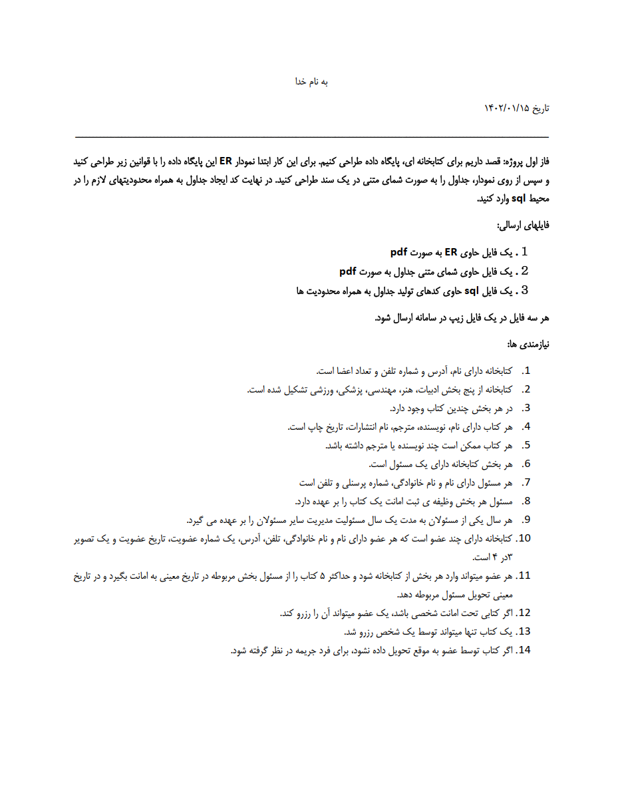

# **🛢 Library DataBase SQL Project | پروژه دیتابیس کتابخانه با SQL**

**A university project in which a library database is designed step by step.**

**یک پروژه دانشگاهی که در آن مرحله به مرحله یک دیتابیس مخصوص کتابخانه طراحی می‌شود.**

# 💬 **نکات پروژه**

* برای اجرا برنامه، بهتر است از برنامه‌ی Microsoft SQL Server استفاده کنید.
* برای دسترسی به همه‌ی پروژه‌های دانشگاهی من، به این لینک مراجعه کنید:

👈🏻 **[پروژه‌های دانشگاهی من](https://github.com/bestmahdi2/Uni__Bachelors_SKU_Path)**

# 📝 **توضیحات پروژه**

